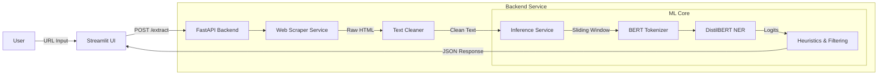

# 🪑 Furniture Product NER Extractor

[](https://www.python.org/)
[](https://fastapi.tiangolo.com/)
[](https://huggingface.co/docs/transformers/model_doc/distilbert)
[](https://streamlit.io/)
[](https://www.docker.com/)
[](https://render.com/)

An intelligent Named Entity Recognition (NER) system designed to extract furniture product names from unstructured e-commerce website text. Built with a fine-tuned **DistilBERT** model, served via **FastAPI**, and visualized with **Streamlit**.

---

## 🚀 Live Demo

- **Frontend (UI):** [Link to your Streamlit App](https://extracting-appucts-from-furniture-websites-wqtggzlrvnxdr33ay6f.streamlit.app/)
- **Backend (API):** [Link to your Render API](https://extracting-products-from-furniture.onrender.com)

---

## 🧠 Project Overview

The goal of this project is to automate the extraction of product catalogs from furniture retailer websites. Unlike traditional rule-based scrapers that break when HTML structure changes, this solution uses **Machine Learning (NLP)** to identify products based on semantic context, making it robust across different websites.

### Key Features
* **Deep Learning Core:** Uses a `DistilBERT` model fine-tuned on a custom dataset of furniture websites.
* **Smart Parsing:** Implements a **Sliding Window** approach to handle long HTML pages without losing context.
* **Robust Scraping:** Extracts clean text from raw HTML, filtering out noise (scripts, styles, ads).
* **Microservices Architecture:** Decoupled Backend (FastAPI) and Frontend (Streamlit) for scalability.
* **Containerized:** Fully Dockerized application with a multi-stage build process for optimization.

---

## 🏗️ Architecture

The system follows **Clean Architecture** principles to ensure maintainability.


## 📊 Methodology & Metrics

### 1. Data Collection & Labeling

Crawled ~100 pages from various furniture retailers. The text was manually annotated using the IOB (Inside-Outside-Beginning) format to label PRODUCT entities.
### 2. Model Training

Chosen DistilBERT (distilbert-base-uncased) for its balance between performance and inference speed (40% smaller and 60% faster than BERT).
    Loss Function: CrossEntropyLoss
    Optimizer: AdamW
    Scheduler: Linear decay with warmup

### 3. Evaluation (Soft Matching)

Strict exact-match metrics are often too harsh for NER tasks in e-commerce (e.g., missing one word in "Large Grey Sofa" results in a 0 score). We implemented a Soft Matching F1 Score based on Levenshtein distance and substring overlap.


| **Metric**    | **Score** | **Description**                                                        |
| ------------- | --------- | ---------------------------------------------------------------------- |
| **Precision** | **~61%**  | The model is fairly accurate when it predicts a product.               |
| **Recall**    | **~42%**  | High variation in product naming conventions makes recall challenging. |
| **Soft F1**   | **~50%**  | A solid baseline for a PoC with limited training data.                 |

---

## 🛠️ Tech Stack

    Language: Python 3.10
    ML Framework: PyTorch, Hugging Face Transformers
    Web Framework: FastAPI, Uvicorn
    Frontend: Streamlit, Pandas
    Scraping: BeautifulSoup4, Requests
    DevOps: Docker, uv (package manager), Render

## 💻 Local Installation & Usage

**Clone the repository:**

```Bash
git clone [https://github.com/YOUR_USERNAME/furniture-project.git](https://github.com/YOUR_USERNAME/furniture-project.git)
cd furniture-project
```

### Option A: Using Docker (Recommended)

Build the image:

> ⚠️ **Note:** The Docker build process includes the **Model Training** phase to ensure reproducibility. 
> Please expect the build to take **5-15 minutes** depending on your CPU. Do not close the terminal while the model is training
```Bash
docker build -t furniture-backend .
```

Run the container:
```Bash
docker run -p 8000:8000 furniture-backend
```
Access the API: Open http://localhost:8000/docs

### Option B: Local Environment (uv)

**Install uv (if not installed):**
```Bash
pip install uv
```
Sync dependencies:
```Bash
uv sync
```
Train the model (First run only):
```Bash
uv run python -m scripts.research.train
```
Run the API:
```Bash
uv run python -m src.api.main
```
Run the Frontend:
```Bash
uv run streamlit run src/ui/app.py
```

---

## 📂 Project Structure
```
furniture-project/
├── data/                   # Raw and processed datasets
├── models/                 # Model checkpoints (gitignored)
├── scripts/
│   └── research/           # Training & Evaluation scripts
│       ├── data_processor.py
│       ├── train.py
│       └── evaluate_soft.py
├── src/
│   ├── api/                # FastAPI endpoints
│   ├── core/               # Configuration & Settings
│   ├── domain/             # Pydantic Schemas
│   ├── services/           # Business Logic (Inference, Scraper)
│   └── ui/                 # Streamlit Frontend
├── Dockerfile              # Multi-stage Docker build
├── pyproject.toml          # Dependencies (uv)
├── uv.lock                 # Exact version lockfile for reproducibility
└── README.md
```

---

## Future Improvements

    Dataset Expansion: Scale training data to 1000+ documents to improve Recall.

    Advanced Post-processing: Implement a classifier to distinguish "Main Product" from "Related Products".

    Active Learning: Create a pipeline where user feedback in the UI retrains the model.

    Hardware Acceleration: Deploy on GPU instances for faster inference (ONNX Runtime).


